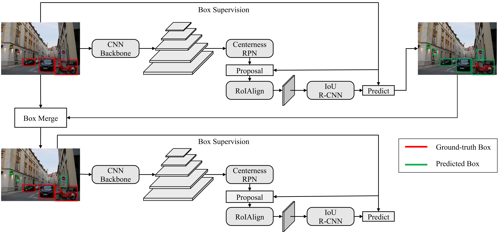
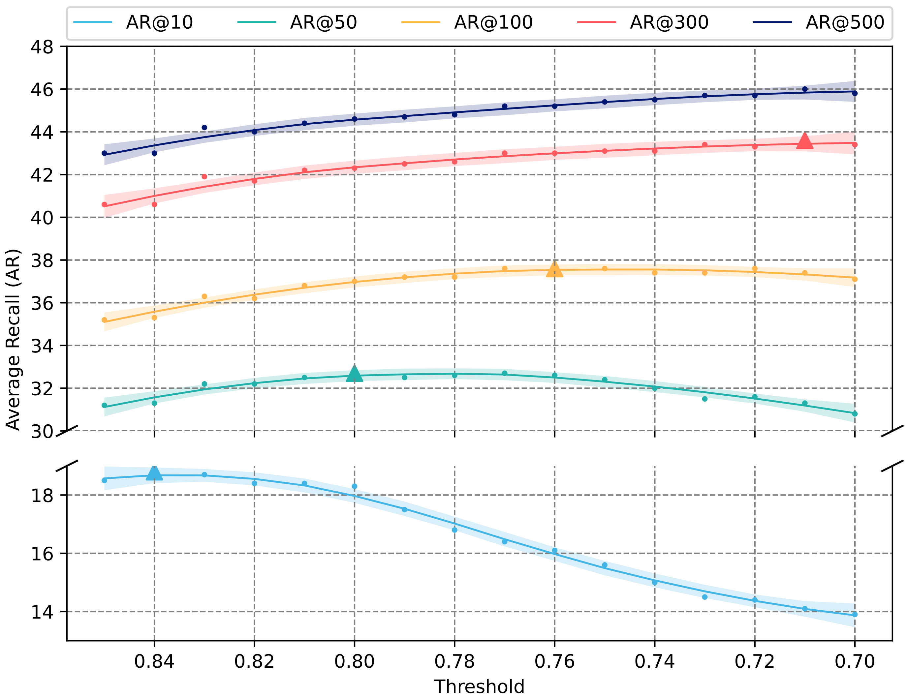
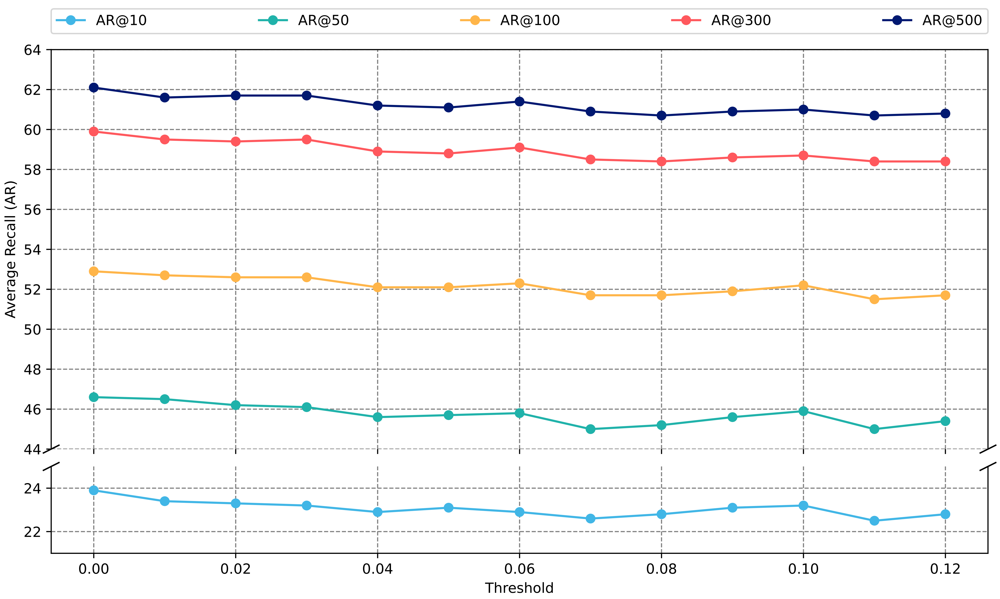

# Eliminating and Mining Strategies for Open-world Object Proposal
Pytorch implementation for "Eliminating and Mining Strategies for Open-world Object Proposal". Paper is coming soon.

## Abstract
Object proposal serves as a crucial pre-task of many image and video understanding
applications. However, modern approaches for object proposal are typically based on
closed-world assumptions, focusing only on pre-defined categories. This approach
cannot meet the diverse needs of real-world applications. To address this limitation, we
introduce two strategies, namely the eliminating strategy and the mining strategy, to
robustly train the Object Localization Network (OLN) for open-world object proposal.
The eliminating strategy takes into account the spatial configuration between labeled
boxes, thereby eliminating box anchors that overlap with multiple objects. The mining
strategy employs a pseudo-label guided self-training scheme, enabling the mining of
object boxes in novel categories. Without bells and whistles, our proposed method
outperforms previous state-of-the-art methods on large-scale benchmarks, including
COCO, Objects365, and UVO.



# Requirements
- Python 3.7
- PyTorch 1.7.0
- mmcv-full 1.2.7
- pycocotools
- opencv-python
- numpy

# Training
## VOC to Non-VOC
```python
# initial training
python -m torch.distributed.launch --nproc_per_node=$GPUS --master_port=$PORT \
    tools/train.py configs/emoln/emoln_voc2nonvoc_r0.py --launcher pytorch ${@:3} --work-dir work_dirs0

# get predictions of training set
python -m torch.distributed.launch --nproc_per_node=$GPUS --master_port=$PORT \
    tools/test.py configs/emoln/emoln_voc2nonvoc_pred.py work_dirs0/latest.pth --launcher pytorch ${@:4} \
    --eval bbox --eval-options jsonfile_prefix="nonVOC"

# generate pseudo labels
python tools/generate_pseudo_labels.py

# self-training
python -m torch.distributed.launch --nproc_per_node=$GPUS --master_port=$PORT \
    tools/train.py configs/emoln/emoln_voc2nonvoc_r1.py --launcher pytorch ${@:3} --work-dir work_dirs1
```
## COCO to UVO
```python
# initial training
python -m torch.distributed.launch --nproc_per_node=$GPUS --master_port=$PORT \
    tools/train.py configs/emoln/emoln_coco2uvo_r0.py --launcher pytorch ${@:3} --work-dir work_dirs0

# get predictions of training set
python -m torch.distributed.launch --nproc_per_node=$GPUS --master_port=$PORT \
    tools/test.py configs/emoln/emoln_coco2uvo_pred.py work_dirs0/latest.pth --launcher pytorch ${@:4} \
    --eval bbox --eval-options jsonfile_prefix="allCOCO"

# generate pseudo labels
python tools/generate_pseudo_labels.py

# self-training
python -m torch.distributed.launch --nproc_per_node=$GPUS --master_port=$PORT \
    tools/train.py configs/emoln/emoln_coco2uvo_r1.py --launcher pytorch ${@:3} --work-dir work_dirs1
```

# Evaluation
## VOC to Non-VOC
```python
python -m torch.distributed.launch --nproc_per_node=$GPUS --master_port=$PORT \
    tools/test.py configs/emoln/emoln_voc2nonvoc_r1.py path/to/latest.pth --launcher pytorch ${@:4} \
    --eval bbox --eval-options jsonfile_prefix="."
```
## COCO to UVO
```python
python -m torch.distributed.launch --nproc_per_node=$GPUS --master_port=$PORT \
    tools/test.py configs/emoln/emoln_coco2uvo_r1.py path/to/latest.pth --launcher pytorch ${@:4} \
    --eval bbox --eval-options jsonfile_prefix="."
```

# Results
## VOC to Non-VOC

## COCO to UVO


# Acknowledgement
This repository is based on [mmdetection](https://github.com/open-mmlab/mmdetection) and [OLN](https://github.com/mcahny/object_localization_network/). We thank the authors for their great work. If you have any questions, please feel free to contact Cheng Wang (wangchust@foxmail.com) or create an issue.